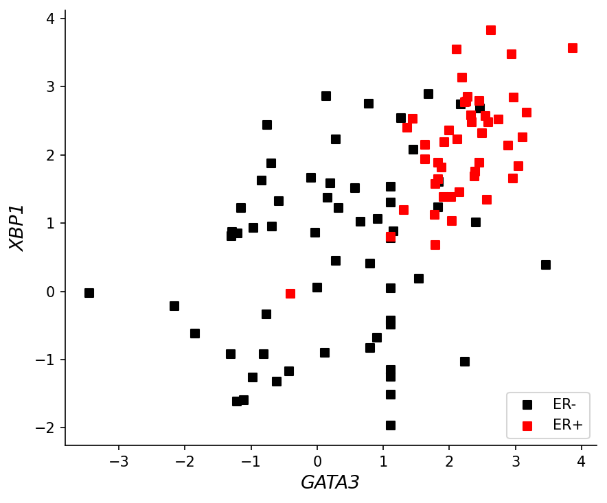
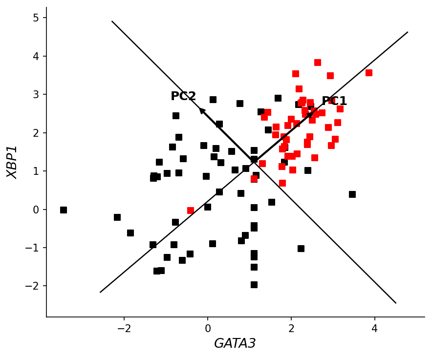
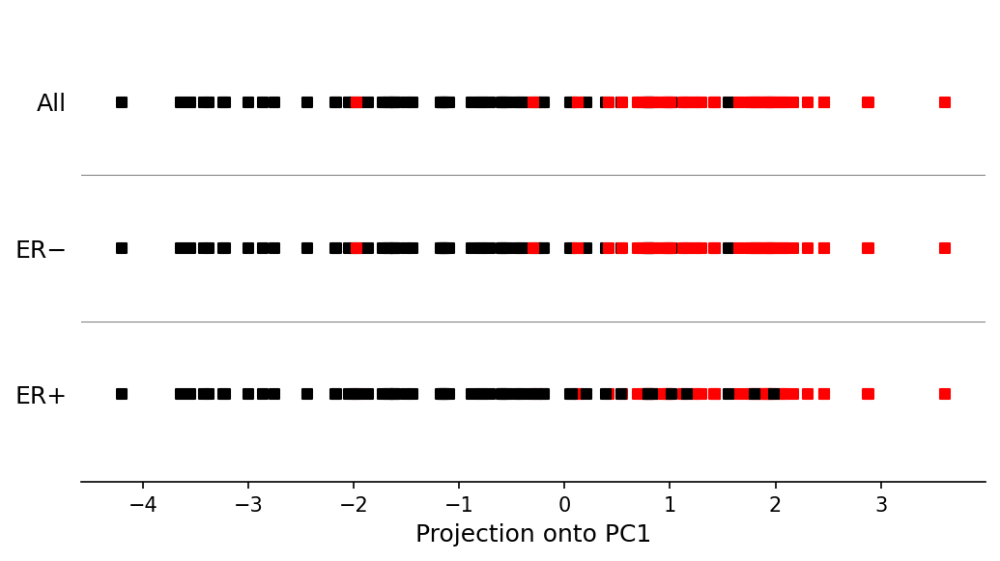

# PCA_Project

## 1. Introduction

Breast cancers are classified based on the expression of certain receptors. One important distinction is between **ER+ (estrogen receptor positive)** and **ER- (estrogen receptor negative)** tumors. These two subtypes respond differently to treatment, so identifying them accurately is critical.

This project uses gene expression data from the GEO dataset [GSE5325](https://www.ncbi.nlm.nih.gov/geo/query/acc.cgi?acc=GSE5325), which contains expression profiles of **105 breast cancer patients** across **16,174 genes**. We reproduce parts of Figure 1 from the [Nature Primer on PCA](https://www.nature.com/articles/nbt0308-303).

## 2. Dataset Description

The data consists of three files:

| File | Description |
|------|-------------|
| `data/class.csv` | Class labels for 105 patients: 1 = ER+, 0 = ER- |
| `data/filtered.tsv.gz` | Expression matrix (105 patients × 16,174 genes), values are normalized |
| `data/columns.tsv.gz` | Gene ID to gene name/symbol mapping |

From the class labels:
- **45 patients** are ER+ (label = 1)
- **60 patients** are ER- (label = 0)

## 3. Plot 1a — XBP1 vs GATA3 Scatter Plot

### What we did

Using the gene ID mapping file (`columns.tsv.gz`), we found:
- **XBP1** corresponds to gene ID **4404**
- **GATA3** corresponds to gene ID **4359**

We extracted the expression values of these two genes for all 105 patients and plotted them as a scatter plot. Each point represents one patient, colored by their ER status:
- **Black squares** = ER- patients
- **Red squares** = ER+ patients

### Result



### Observations

- There is a clear **positive correlation** between GATA3 and XBP1 expression — patients with high GATA3 tend to also have high XBP1.
- **ER+ patients (red)** cluster in the **upper-right** region, meaning they have high expression of both genes.
- **ER- patients (black)** are more spread out but tend to occupy the **lower-left** region.
- The two classes are not perfectly separable using just these two genes, but there is a clear trend — which is exactly what the paper shows.

## 4. Plot 1b — PCA Directions on the Scatter Plot

### What we did

After computing PCA on the 2D data (GATA3, XBP1), we overlaid the directions of PC1 and PC2 on the same scatter plot. The two principal component directions are drawn as lines passing through the data center (mean), with arrows indicating each axis.

- **PC1** (the direction of maximum variance) runs from lower-left to upper-right, roughly along the positive correlation between GATA3 and XBP1.
- **PC2** is perpendicular to PC1 and runs from lower-right to upper-left.

### Result



### Observations

- The **PC1 direction** aligns with the trend in the data — it captures the shared increase in both GATA3 and XBP1 expression. This is why projecting onto PC1 separates ER+ from ER-.
- The **PC2 direction** is perpendicular and captures the remaining variance, which is mostly noise or within-class variation.
- The two lines form a new coordinate system centered at the data mean. PCA essentially rotates the original axes (GATA3, XBP1) into these new directions.

## 5. Plot 1c — Projection onto PC1

### What is PCA?

Principal Component Analysis (PCA) finds the directions of maximum variance in the data. When we have 2D data (GATA3 and XBP1 expression), PCA finds two orthogonal axes:
- **PC1**: the direction along which the data varies the most
- **PC2**: perpendicular to PC1, captures the remaining variance

### What we did

1. Built a 2D matrix from GATA3 and XBP1 expression values (105 × 2).
2. **Centered** the data by subtracting the mean of each column.
3. Computed the **covariance matrix**:

```
Covariance Matrix:
[[2.059  1.097]
 [1.097  1.884]]
```

4. Performed **eigen decomposition** to find the principal components.
5. **PC1 explains 77.9%** of the total variance — so most of the information is captured by just this one direction.
6. Projected all 105 patients onto PC1 to get a single number per patient.

### Result



The plot shows three horizontal strips:

- **All**: All 105 patients projected onto PC1, colored by class.
- **ER−**: Shows all patients, with ER- (black) dominating the left side.
- **ER+**: Shows all patients, with ER+ (red) clustering on the right side.

### Observations

- After projecting onto PC1, the **ER+ and ER- groups become more separable** along a single axis.
- ER+ patients tend to have **positive PC1 values** (right side), while ER- patients tend to have **negative PC1 values** (left side).
- This shows the power of PCA: by finding the direction of maximum variance, it naturally separates the two cancer subtypes.
- The separation is not perfect (there is some overlap), but the trend is strong and matches the paper.

## 6. Code Summary

The analysis script (`PCA_Project.py`) does the following:

1. **Loads** the expression data and class labels
2. **Extracts** XBP1 (ID 4404) and GATA3 (ID 4359) expression values
3. **Plots Figure 1a**: scatter plot of XBP1 vs GATA3, colored by ER status
4. **Runs PCA** on the 2D data (manual implementation using numpy):
   - Centers the data
   - Computes covariance matrix
   - Eigen decomposition
   - Projects onto PC1
5. **Plots Figure 1b**: scatter plot with PC1 and PC2 direction arrows overlaid
6. **Plots Figure 1c**: three-strip projection plot showing class separation along PC1

### Dependencies

- Python 3
- numpy
- pandas
- matplotlib

### How to run

```bash
python PCA_Project.py
```

This will generate three output images:
- ` PCA_1a.png` — XBP1 vs GATA3 scatter plot
- `PCA_1b.png` — Scatter plot with PC1/PC2 direction arrows
- `PCA_1c.png` — PC1 projection plot

## 7. Conclusion

Using just two genes (XBP1 and GATA3), we can already see a pattern distinguishing ER+ and ER- breast cancer patients. The scatter plot (1a) shows ER+ patients clustering in the high-expression region. Overlaying the PCA axes (1b) reveals that the direction of maximum variance (PC1) aligns with the correlation between these two genes. Projecting onto PC1 (1c) reduces the 2D data to a single axis that naturally separates the two cancer subtypes, capturing **77.9%** of the total variance. This demonstrates how dimensionality reduction techniques like PCA can reveal underlying biological structure in gene expression data.
